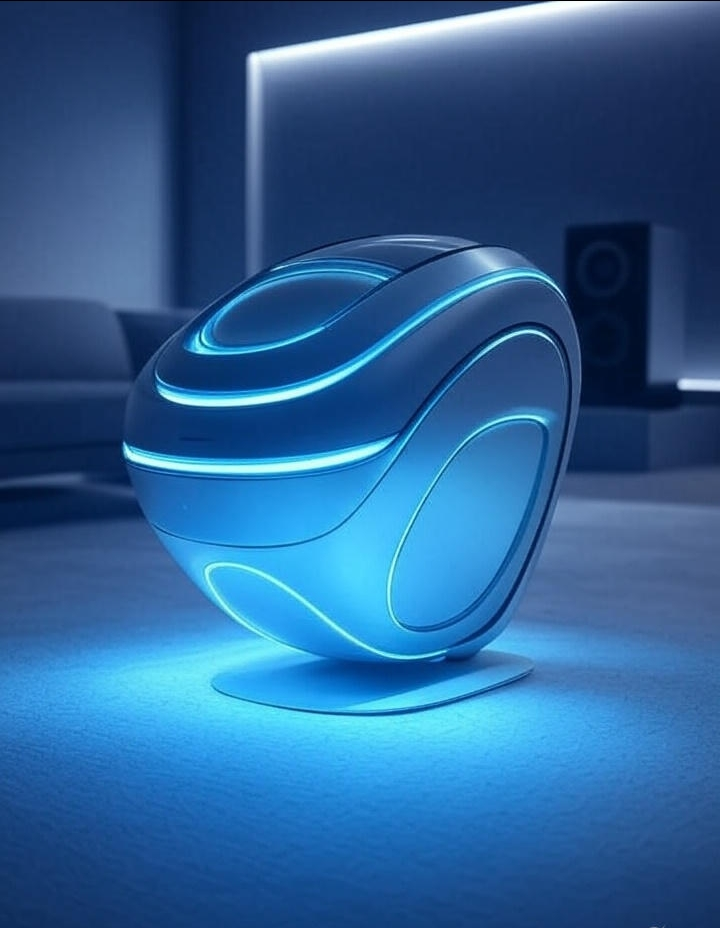

# Sound-Therapy-AI-System

Sound Therapy AI is an end-to-end system that generates personalized therapeutic sound frequencies.

# 1. Component Specifications
Audio Generation Service
Wave synthesis (sine, square, sawtooth, triangle)
ADSR envelope control
Binaural/isochronic beat generation
Resonance harmonic algorithms

# 2. AI Recommendation Service
Condition-frequency mapping database
Personalized frequency optimization
Physiological response prediction
Therapy session planning

# 3. Biometric Integration Layer
Wearable device API connections
Real-time physiological monitoring
Stress/relaxation level quantification
Feedback loop for audio adjustment

#  Installation Guide
## Prerequisites
Python 3.10+
GitHub Codespaces or Docker
PortAudio library
Web browser with Web Audio API support
